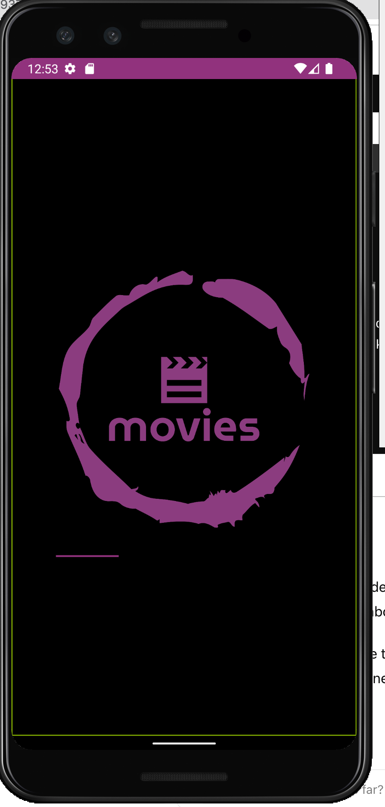
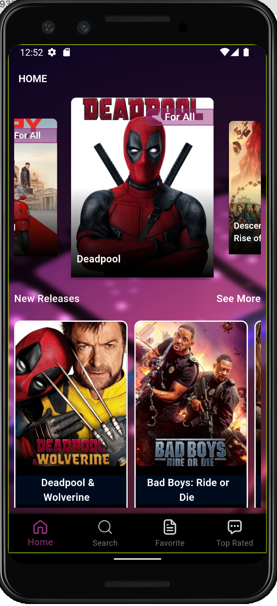
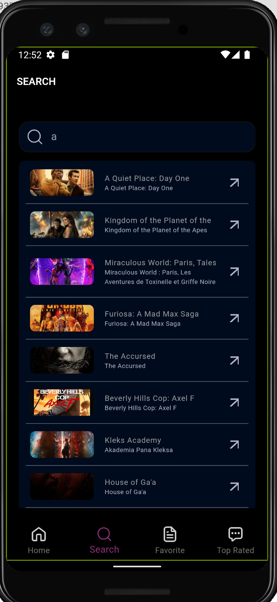
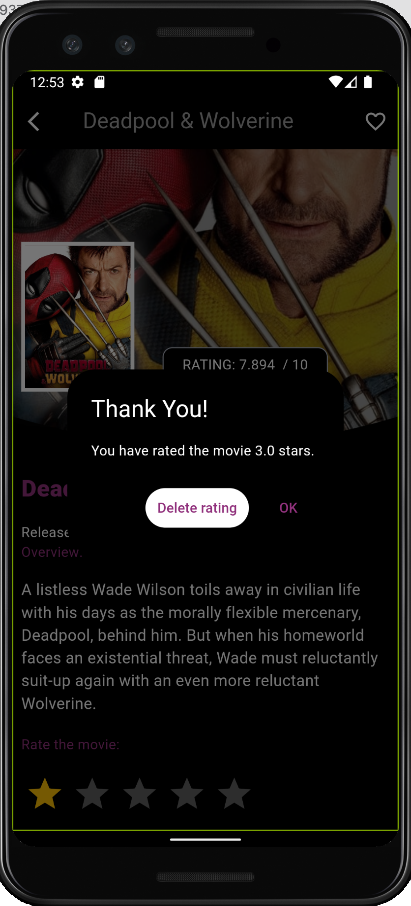
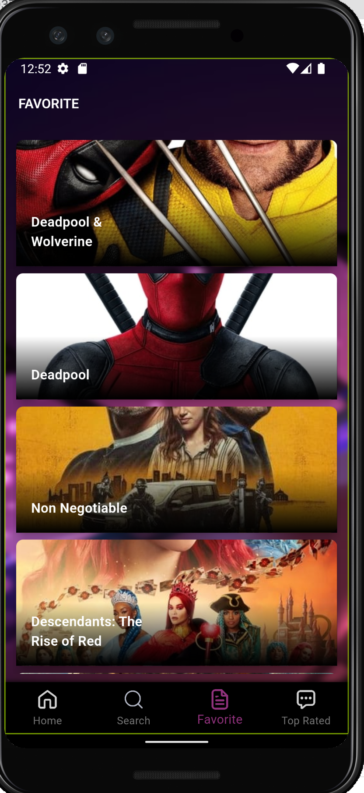
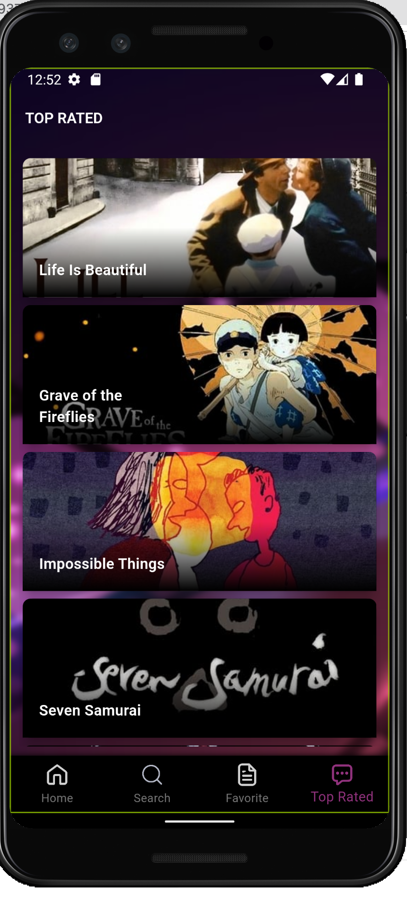
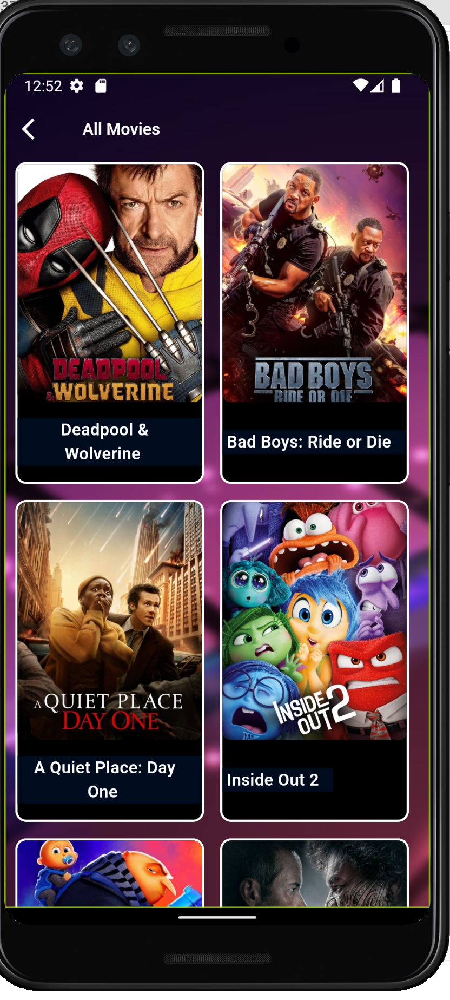
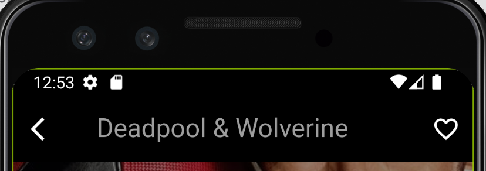

# Movie App (Task delivered By Zeinab Tarek )

### BLOC + TDD ###

## Table of Contents

- [Introduction](#introduction)
- [Features](#features)
- [Screenshots](#screenshots)
- [Architecture](#architecture)
- [Setup and Installation](#setup-and-installation)
- [Running the App](#running-the-app)
- [Security Measures](#security-measures)
- [Performance Enhancements](#performance-enhancements)
- [Theme Change and Localization](#theme-change-and-localization)
- [Contributing](#contributing)
- [License](#license)

## Introduction
 
Movie App is a Flutter application that allows users to discover, search, and rate movies using the TMDb API. Users can browse new releases, top-rated movies, and manage their favorite movies.

## Features

- Browse movies by categories
- Top Rated Movies
- Search for movies
- View movie details and ratings
- Add movies to favorites
- Delete the Rate
- Rate movies
- Offline support

## Screenshots













 
## Architecture

This project follows Clean Architecture principles and uses BLoC (Business Logic Component) for state management. The architecture is divided into several layers:

1. Presentation Layer: Contains UI code and BLoC for state management.
2. Domain Layer**: Contains business logic and use cases.
3. Data Layer: Contains repositories and data sources.

### Folder Structure

``` i added this arch as a schema for bersonal use(Zeinab )
lib/
├── data/
│   ├── models/
│   ├── repositories/
│   └── data_sources/
├── domain/
│   ├── entities/
│   ├── usecases/
│   └── repositories/
├── presentation/
│   ├── blocs/
│   ├── screens/
│   └── widgets/
└── main.dart
```

### BLoC and TDD

BLoC is used to manage the state of the application, making the code more modular and testable. Test-Driven Development (TDD) is used to write tests before implementing features, ensuring code quality and reliability.

## Setup and Installation

1. **Clone the Repository**

    ```bash
    git clone https://github.com/zainatariq/movie_task_bloc_tdd.git
    cd movie_app
    ```

2. **Install Dependencies**

    ```bash
    flutter pub get
    ```

3. **Setup Environment Variables**

    Create a `.env` file in the root directory and add your TMDb API key:

    ```
    API_KEY=your_tmdb_api_key
    ```

4. **Generate Code**

    ```bash
    flutter pub run build_runner build
    ```

## Running the App

To run the app, use the following command:

```bash
flutter run
```

## Security Measures

- API keys and other critical data are stored in environment variables, which are not checked into version control.
- Sensitive data is accessed through the `.env` file, ensuring security and flexibility.

## Performance Enhancements

- Used lazy loading for images and data to improve performance.
- Implemented caching for API responses to reduce network calls.
- Optimized build methods in widgets to reduce rebuilds.

## Theme Change and Localization

- The app supports dark and light themes. Users can switch between themes in the settings.
- Localization is implemented using the `intl` package. The app currently supports English and Arabic. More languages can be added easily.

## Contributing

Contributions are welcome! Please fork this repository and submit pull requests.

## License

This project is licensed under the MIT License - see the [LICENSE](LICENSE) file for details.

---

### Steps for Localization and Theme Change

#### Localization

1. **Add the `intl` package to `pubspec.yaml`**

    ```yaml
    dependencies:
      flutter:
        sdk: flutter
      intl: ^0.17.0
    ```

2. **Create Localization Files**
   

 

3. **Configure Localization**

    Update `MaterialApp` to support localization:

    ```dart
    // return MaterialApp(
    //   localizationsDelegates: [
    //     GlobalMaterialLocalizations.delegate,
    //     GlobalWidgetsLocalizations.delegate,
    //     GlobalCupertinoLocalizations.delegate,
    //     AppLocalizations.delegate,
    //   ],
    //   supportedLocales: [
    //     Locale('en', ''), // English
    //     Locale('ar', ''), // Arabic
    //   ],
    //   localeResolutionCallback: (locale, supportedLocales) {
    //     // Logic to resolve locale
    //   },
    //   home: HomeScreen(),
    // );
    ```

4. **Use Localized Strings**

    ```dart
    // Text(LocaleKeys.welcome.tre)
    ```

#### Theme Change

1. **Define Themes**

    ```dart
    // final ThemeData lightTheme = ThemeData.light().copyWith(
    //   primaryColor: Colors.blue,
    // );
    //
    // final ThemeData darkTheme = ThemeData.dark().copyWith(
    //   primaryColor: Colors.black,
    // );
    ```

2. **Update `MaterialApp` to use Theme**

    ```dart
    // return MaterialApp(
    //   theme: lightTheme,
    //   darkTheme: darkTheme,
    //   themeMode: ThemeMode.system, // Can be changed to ThemeMode.light or ThemeMode.dark
    //   home: HomeScreen(),
    // );
    ```

3. **Add Theme Switch in Settings**

    ```dart
    // SwitchListTile(
    //   title: Text('Dark Mode'),
    //   value: isDarkMode,
    //   onChanged: (value) {
    //     setState(() {
    //       isDarkMode = value;
    //       MyApp.of(context).setThemeMode(
    //         isDarkMode ? ThemeMode.dark : ThemeMode.light,
    //       );
    //     });
    //   },
    // );
    ```

---

### Including Screenshots
Find screenshots in path('../movie_task_bloc_tdd/screenshots)